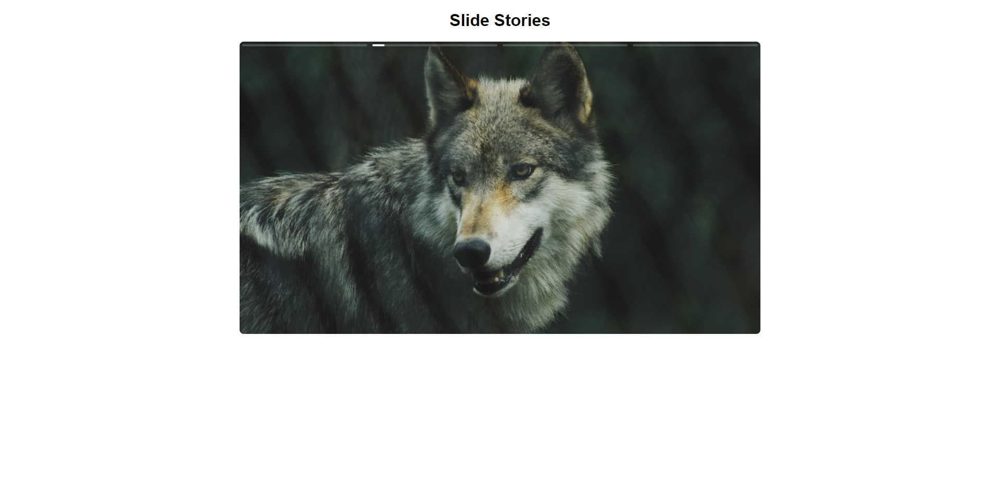

  

# 🖼 Slide Stories - TypeScript
Projeto de um site de vendas de bicicletas personalizadas. Nesse projeto eu aprendi bastante sobre sobre HTML e CSS, depois desse projeto e outras práticas aprimorei muito meu CSS.

- Veja o projeto: [Live Preview](https://stories-slide.vercel.app/)

## ⚙️ Funcionalidades

- [x] Slide fluido, totalmente intuitivo;
- [x] Funciona com o mouse e com o touch;
- [x] Funciona clicando mais para a direita ou esquerda para passar e voltar;
- [x] Ao segurar o dedo ou o mouse, pausa a imagem ou vídeo;
- [x] Feito somente com Typescript sem plugins ou bibliotecas;

## 🚀 Tecnologias

- [HTML](https://www.w3schools.com/html/)
- [CSS](https://developer.mozilla.org/pt-BR/docs/Web/CSS)
- [JavaScript](https://developer.mozilla.org/pt-BR/docs/Web/JavaScript)
- [TypeScript](https://www.typescriptlang.org/)

## 📝 Considerações

Nesse projeto do curso da Origamid, eu pude aprender bastante sobre vários conceitos de TypeScript, e como fazer um código robusto resolvendo várioos problemas, e também a lógica por trás de um slide stories;
